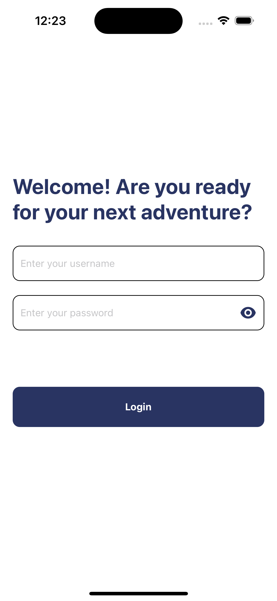
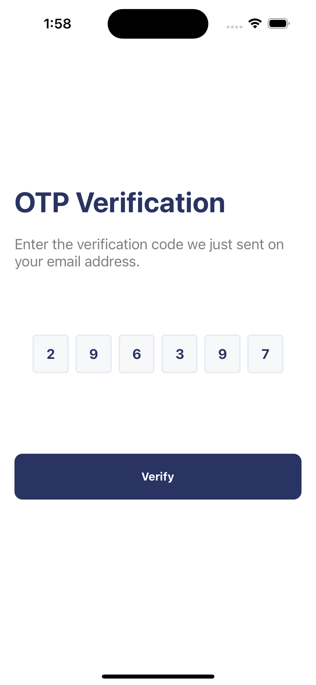
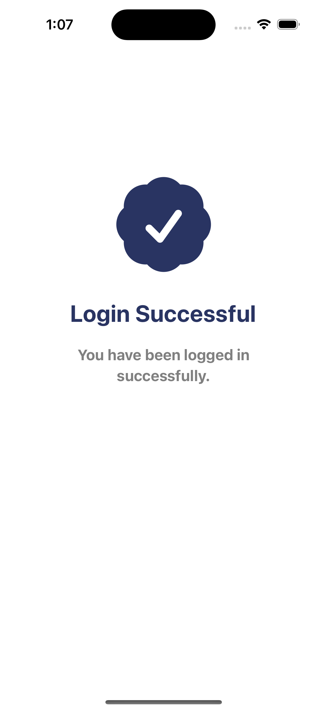
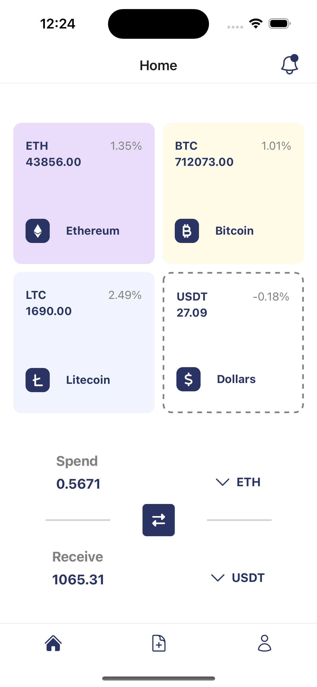
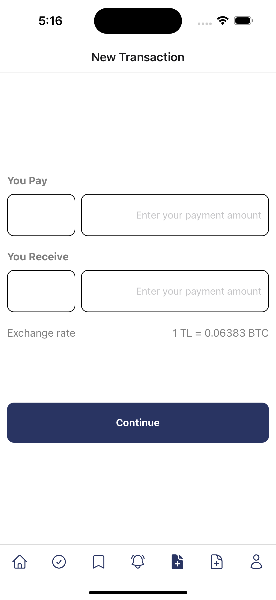
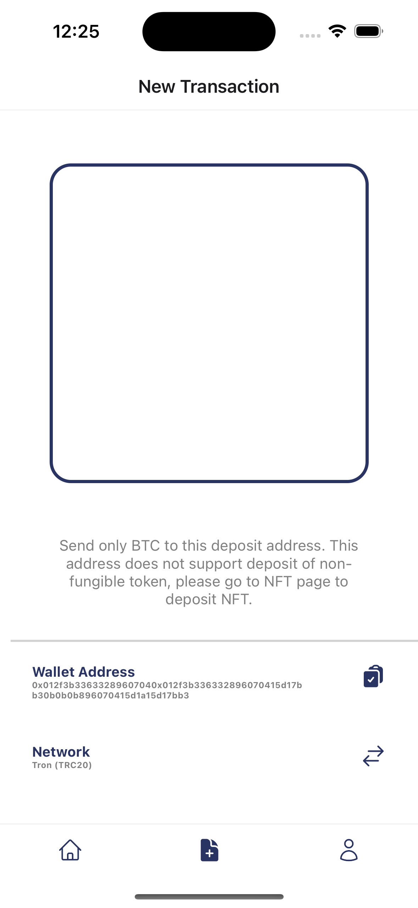
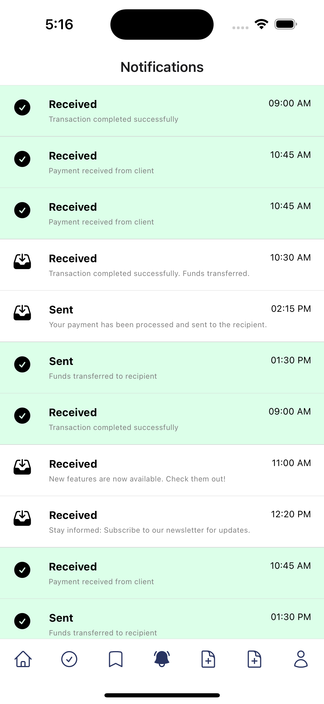
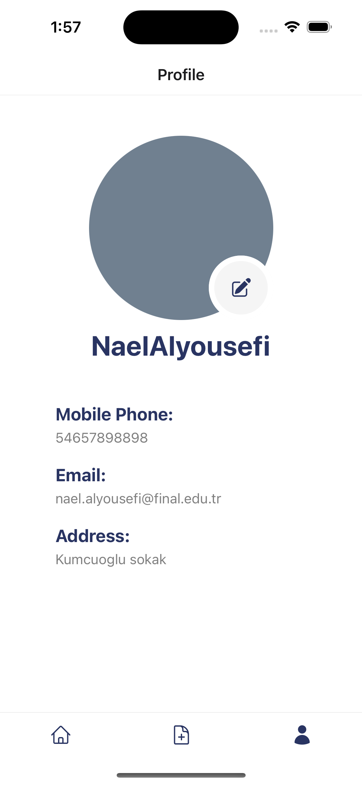

## Payone mobile

A repository for the Payone mobile crypto application, built with React Native and Expo.

## Current work stages

- [x] Main screens
- [x] Binance API calls for exchange rates
- [ ] Vendor API calls for QR generation and user info
- [ ] UI completion
- [ ] App Navigation
- [ ] App Responsiveness
- [ ] Application security


## Installation and testing

It is recommended to update ```Node``` from time to time.
Use ```git clone``` and ```git pull``` downloading the project and latest changes respectively.

```
cd <project_folder>/ && npm install
npm start
```

Valid testing credentials: \
Username: arekan-user \
Password: ArekanSoft123


## Screens

- Screen 1 - Login
- Screen 2 - OTP Verification
- Screen 3 - Successful Operation
- Screen 4 - Home / Main
- Screen 5 - New Transaction 
- Screen 6 - QR Code Generator
- Screen 7 - Notifications
- Screen 8 - Profile / Account


| Screen 1             | Screen 2           | Screen 3               |
|----------------------|--------------------|------------------------|
|  |  |  |


| Screen 4            | Screen 5                   | Screen 6          |
|---------------------|----------------------------|-------------------|
|  |  |  |


| Screen 7                     | Screen 8               |
|------------------------------|------------------------|
|  |  |

## Application support and further enquiries

Supporting developer: Nikita Korolev 

Telegram (preferred): @nk25dev  

WhatsApp: +90 548 855 70 74 

Email: nk25.dev@gmail.com
