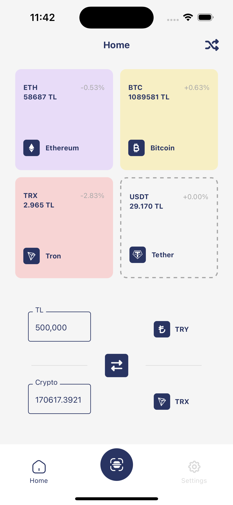
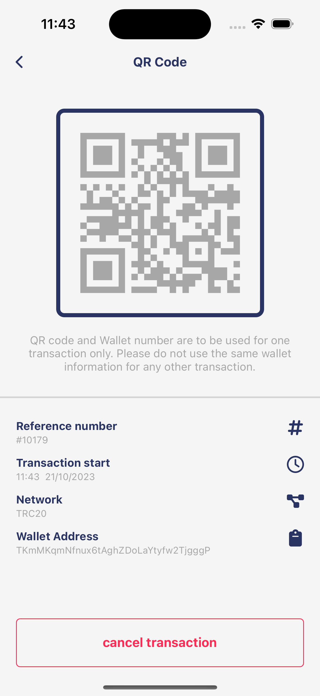
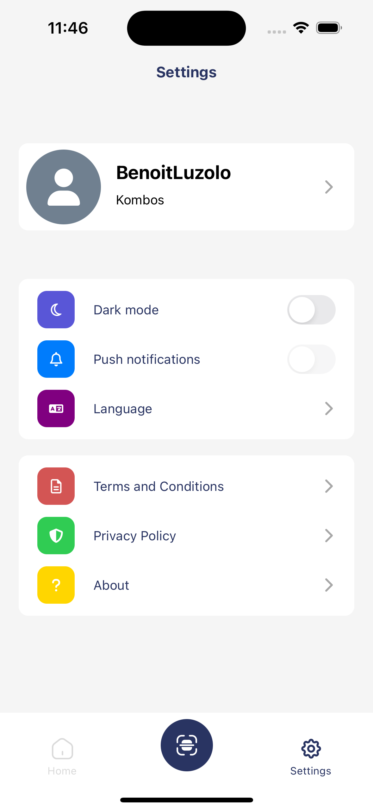
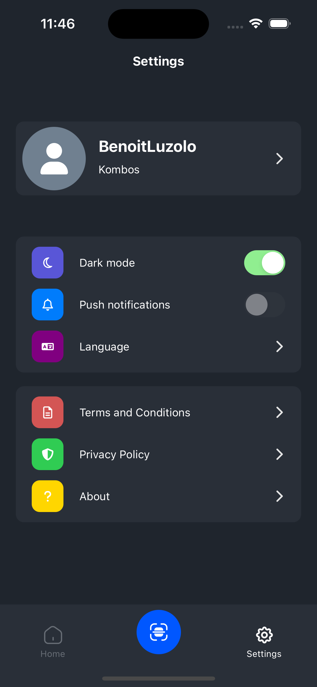
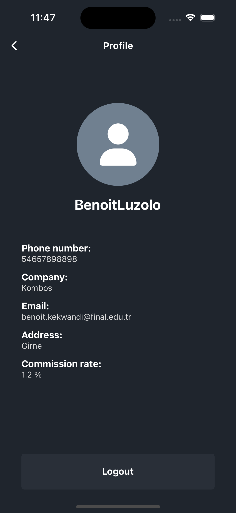

## Payone mobile


A repository for the Payone mobile crypto application, built with React Native and Expo.
<br>

## Current work stages

Following features are supported:

- [x] Binance API calls for exchange rates
- [x] Vendor API calls for QR generation and user info
- [x] Transaction History
- [x] Device localization (tr, en, ru)
- [x] App Responsiveness and security
- [x] Dark mode

## Installation and building

It is recommended to update ```Node``` from time to time.
Use ```git clone``` and ```git pull``` downloading the project and latest changes respectively.

```
cd <project_folder>/ && npm install
npx expo start (--reset-cache is optional)
```

Building:

```
npm install -g eas-cli
eas login
eas build --platform android/ios --profile android-apk/ios-simulator
```

## Screens

- Screen 1 - Login
- Screen 2 - OTP Verification
- Screen 3 - Successful Operation
- Screen 4 - HomeTab / Main
- Screen 5 - New Transaction 
- Screen 6 - QR Code Generator
- Screen 7 - SettingsTab
- Screen 8 - Profile / Account


| Screen 1                         | Screen 1                       | Screen 2                       | Screen 2                     |
|----------------------------------|--------------------------------|--------------------------------|------------------------------|
|  |  |  |  |


| Screen 3                            | Screen 3                         | Screen 4                         | Screen 4                      |
|-------------------------------------|----------------------------------|----------------------------------|-------------------------------|
|   |  |   |  |


| Screen 5                               | Screen 5                             | Screen 6                      | Screen 6                    |
|----------------------------------------|--------------------------------------|-------------------------------|-----------------------------|
|  |  |  |  |


| Screen 7                            | Screen 7                          | Screen 8                           | Screen 8                         |
|-------------------------------------|-----------------------------------|------------------------------------|----------------------------------|
|  |  |  |  |
